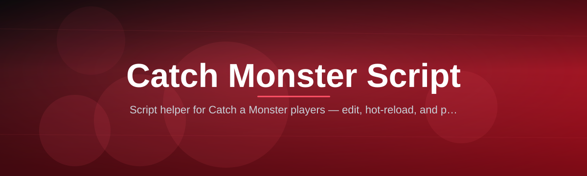

# catch-a-monster-script-helper

Script helper for Catch a Monster players — edit, hot-reload, and preview pipeline in one .exe.

  

## Overview

Script helper for Catch a Monster players — edit, hot-reload, and preview pipeline in one .exe.

## License

[MIT License](LICENSE)
